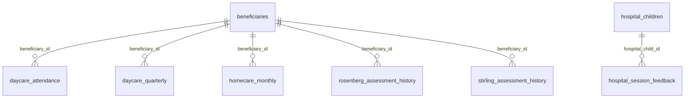

# Happy Feet Home — Phase 1 handover

**Status:** Phase 1 data model, Supabase schema, and pilot data migration completed. No front end is included.
**Database:** Supabase project `pre-kc2-happy-feet-test` (`ktobhlqfeqdxydppczmm`), Mumbai (`ap-south-1`).
**Source workbook:** [Happy_Feet_Home_DUMMY_Data](https://docs.google.com/spreadsheets/d/1yZvg0Eh_e2j4PhNu5FMtTVhPEjucwewnKAqKv1WiTK0/edit?usp=drivesdk).

## Scope and source tabs

The import was limited to these seven live source tabs. Other workbook tabs, including `OLD TO NEW MAP`, `4A. Rosenberg Assessment`, and `4B. Stirling Assessment`, were excluded.

| Source tab | Table |
|---|---|
| `1. Beneficiaries` | `beneficiaries` |
| `2. Daycare Attendance` | `daycare_attendance` |
| `3A. Daycare InputsOutputs (Qtly)` | `daycare_quarterly` |
| `3B. Homecare InputsOutputs (Mtl)` | `homecare_monthly` |
| `3C. Hospital Session Feedback` | `hospital_session_feedback` |
| `5A. Rosenberg Assessment hist` | `rosenberg_assessment_history` |
| `5B. Stirling Assessment hist` | `stirling_assessment_history` |

`hospital_children` is a derived parent table built from distinct non-empty child names in Hospital Session Feedback. It is not a source tab.

## Entity relationship diagram

Hospital feedback children are separate from Beneficiaries and are not linked across those populations. Children identified by name only; live projects should capture a child ID.

## Tables and fields

Types below reflect the deployed PostgreSQL schema. `PK` and `FK` identify keys. Fields not marked `NOT NULL` may contain nulls unless a separate constraint applies. All source-backed tables include required source tracking columns.

### `beneficiaries`

**PK:** `beneficiary_id text`

- `registration_date date`; `name_of_child text`; `program program_enum`; `primary_diagnosis text`; `sub_diagnosis text`; `gender text`; `level_of_care text`; `location text`; `address text`
- `date_of_birth date`; `age integer`; `primary_mobile_no text`; `secondary_mobile_no text`
- `current_status_life_goals text`; `life_goals_discontinued_date date`; `family_occupation text`; `family_members text`; `interested_in_daycare_program text`
- `hospital hospital_enum`; `ward_department ward_enum`; `status status_enum`; `exit_date date`; `job_description text`; `financially_independent text`; `salary_per_month numeric`
- `notes text`; `source_used text`; `verification_from_goalkeep boolean`; `verification_from_hfh boolean`; `doubt_from_goalkeep text`; `hfh_comments text`
- `source_file text NOT NULL`; `source_sheet text NOT NULL`; `source_row integer NOT NULL`

### `daycare_attendance`

**PK:** `attendance_id uuid` (database generated). **FK:** `beneficiary_id text NOT NULL → beneficiaries.beneficiary_id`.

- `financial_year text`; `month month_enum`; `day_01`, `day_02`, `day_03`, `day_04`, `day_05`, `day_06`, `day_07`, `day_08`, `day_09`, `day_10`, `day_11`, `day_12`, `day_13`, `day_14`, `day_15`, `day_16`, `day_17`, `day_18`, `day_19`, `day_20`, `day_21`, `day_22`, `day_23`, `day_24`, `day_25`, `day_26`, `day_27`, `day_28`, `day_29`, `day_30`, `day_31` attendance_code_enum; `total_present integer`; `had_access_to_4_meals_a_day boolean`; `name_of_child text`
- `notes text`; `source_used text`; `verification_from_goalkeep boolean`; `verification_from_hfh boolean`; `doubt_from_goalkeep text`; `hfh_comments text`
- `source_file text NOT NULL`; `source_sheet text NOT NULL`; `source_row integer NOT NULL`

Kept in source shape: one row per beneficiary per month with day columns 1–31. It was not reshaped.

### `daycare_quarterly`

**PK:** `daycare_quarterly_id uuid` (database generated). **FK:** `beneficiary_id text NOT NULL → beneficiaries.beneficiary_id`.

- `name_of_child text`; `financial_year text`; `quarter quarter_enum`; `diagnosis text`
- `grocery_support_required_date date`; `grocery_support_provided_date date`; `medicine_support_required_date date`; `medicine_support_provided_date date`
- `one_to_one_therapy_required_date date`; `one_to_one_therapy_provided_date date`
- `intensive_intervention_psychiatric_medicines_required_date date`; `intensive_intervention_psychiatric_medicines_provided_date date`
- `educational_support_required_date date`; `educational_provided_required_date date`
- `height_in_cm numeric`; `weight_in_kg numeric`; `cd4_for_hiv_children numeric`; `viral_load_for_hiv text`; `no_of_blood_transfusions_in_a_month integer`; `hospital_admissions_in_quarter text`
- `current_status_education text`; `school_college_fees_tuition text`; `extracurricular_support text`; `home_schooling_tuition text`; `life_skill_empowerment_session_at_hfh text`; `english_speaking_session text`; `extracurricular_activities text`; `celebration_exposure text`
- `life_status status_enum`; `exit_date date`; `basic_necessities text`; `notes text`; `source_used text`; `verification_from_goalkeep boolean`; `verification_from_hfh boolean`; `doubt_from_goalkeep text`; `hfh_comments text`
- `source_file text NOT NULL`; `source_sheet text NOT NULL`; `source_row integer NOT NULL`

### `homecare_monthly`

**PK:** `homecare_monthly_id uuid` (database generated). **FK:** `beneficiary_id text NOT NULL → beneficiaries.beneficiary_id`.

- `name_of_child text`; `financial_year text`; `month month_enum`; `diagnosis_illness text`; `contact_number text`; `life_status status_enum`; `exit_date date`; `contact_type contact_type_enum`; `home_call_visit_date date`
- `therapist_social_worker_nurse text`; `grocery_support_required_date date`; `grocery_support_provided_date date`; `medicine_support_required_date date`; `medicine_support_provided_date date`; `educational_support_required_date date`; `educational_support_provided_date date`
- `any_other_support_required text`; `any_other_support_provided text`; `weight_in_kg numeric`; `height_in_cm numeric`; `notes text`; `source_used text`; `verification_from_goalkeep boolean`; `verification_from_hfh boolean`; `doubt_from_goalkeep text`; `hfh_comments text`
- `source_file text NOT NULL`; `source_sheet text NOT NULL`; `source_row integer NOT NULL`

### `hospital_children`

**PK:** `hospital_child_id text` (sequence-backed database ID, formatted `H-0001`, `H-0002`, …). `child_name text NOT NULL UNIQUE`, identified by exact name only. `source_file text NOT NULL`, `source_sheet text NOT NULL`, `source_row integer NOT NULL`. The chosen source row is a trace to where a distinct child name first appeared.

### `hospital_session_feedback`

**PK:** `hospital_session_feedback_id uuid` (database generated). **FK:** `hospital_child_id text NOT NULL → hospital_children.hospital_child_id`.

- `facilitator text`; `session_date date`; `diagnosis text`; `hospital_name hospital_enum`; `ward ward_enum`
- `ritual text`; `warm_up text`; `core_activity text`; `closure text`; `feeling_on_entry text`; `feeling_during_activity text`; `felt_relaxed text`; `activity_fun text`; `would_attend_again text`; `notes text`; `source_used text`
- `source_file text NOT NULL`; `source_sheet text NOT NULL`; `source_row integer NOT NULL`

### `rosenberg_assessment_history`

**PK:** `rosenberg_assessment_id uuid` (database generated). **FK:** `beneficiary_id text NOT NULL → beneficiaries.beneficiary_id`.

- `name_of_child text`; `assessment_date date`
- Question fields: `q1_raw text`, `q1_value smallint`; `q2_raw text`, `q2_value smallint`; `q3_raw text`, `q3_value smallint`; `q4_raw text`, `q4_value smallint`; `q5_raw text`, `q5_value smallint`; `q6_raw text`, `q6_value smallint`; `q7_raw text`, `q7_value smallint`; `q8_raw text`, `q8_value smallint`; `q9_raw text`, `q9_value smallint`; `q10_raw text`, `q10_value smallint`. Each raw field has CHECK IN ('SA','A','DA','SD'); each value field has CHECK 1–4.
- `source_total_score integer`; `notes text`; `verification_from_goalkeep boolean`; `verification_from_hfh boolean`; `doubt_from_goalkeep text`; `hfh_comments text`
- `source_file text NOT NULL`; `source_sheet text NOT NULL`; `source_row integer NOT NULL`

Raw codes and straight numeric conversion are stored. Mapping is SD=1, DA=2, A=3, SA=4. No reverse scoring is applied and the supplied source total is never recalculated. **Open question:** "Rosenberg straight 1-4 sums matched 0 of 5 source totals; scoring key (scale, reversed items) to be validated with the NGO."

### `stirling_assessment_history`

**PK:** `stirling_assessment_id uuid` (database generated). **FK:** `beneficiary_id text NOT NULL → beneficiaries.beneficiary_id`.

- `name_of_child text`; `test_type assessment_test_type_enum`; `assessment_date date`; `q1 smallint`, `q2 smallint`, `q3 smallint`, `q4 smallint`, `q5 smallint`, `q6 smallint`, `q7 smallint`, `q8 smallint`, `q9 smallint`, `q10 smallint`, `q11 smallint`, `q12 smallint`, `q13 smallint`, `q14 smallint`, `q15 smallint` (each CHECK 1–5); `source_total_score integer`
- `notes text`; `verification_from_goalkeep boolean`; `verification_from_hfh boolean`; `doubt_from_goalkeep text`; `hfh_comments text`; `source text`
- `source_file text NOT NULL`; `source_sheet text NOT NULL`; `source_row integer NOT NULL`

## Enums and checks

| Type | Values | Purpose |
|---|---|---|
| `program_enum` | Daycare, Homecare | Short program selection. |
| `status_enum` | Active, Deceased | Reused life/status value. |
| `month_enum` | January–December | Month field values. |
| `quarter_enum` | Q1–Q4 | Quarterly reporting period. |
| `contact_type_enum` | Call, Visit | Short contact method list. |
| `assessment_test_type_enum` | Pre, Post | Stirling assessment type. |
| `attendance_code_enum` | P, NA | Daily attendance codes. |
| `ward_enum` | General Ward, Hematology Ward, Pediatric Ward, Ward A, Ward B | Short ward list from source distinct values. |
| `hospital_enum` | Metro Care Hospital A, B, C, D | Short hospital list from source distinct values. |

Long or inconsistent lists (activities, staff/facilitators, sub-diagnosis and similar) remain plain text. Rosenberg answer codes and numeric ranges, and Stirling numeric ranges use CHECK constraints.

## Keys, constraints, and indexes

- Source-backed records have a unique constraint on `(source_file, source_sheet, source_row)`, used as the pilot rerun key.
- The beneficiary FK is required on every beneficiary-linked table; no record lacking a known beneficiary ID is inserted.
- Hospital feedback requires a known hospital child. Blank-name feedback rows are excluded and logged.
- Every foreign key has an index.
- UUID primary keys are generated for event/history tables. Beneficiary ID remains the source's business ID. Hospital child IDs use a separate sequence and `H-` prefix.
- There is no inferred rule linking a hospital child and a beneficiary, or linking month/quarter beyond the source fields.

## Source tracking and migration behavior

Every imported row records `source_file`, `source_sheet`, and `source_row`. The repeatable pilot importer uses this row reference to update an already-migrated row instead of inserting duplicates.

**Limitation:** source row number is not a durable identifier. If a source tab is sorted or rows are inserted since the prior run, a full clean reload is required instead of row-reference updates. The source workbook may continue changing; any later run must re-check live tabs and headers before import.

## Migration results

A total of 12,890 source rows were reviewed across the seven approved tabs. **12,724 inserted; 0 updated; 0 unchanged; 166 failed.** No rows failed silently. Failed row details are in the [seven-tab migration failure log](https://docs.google.com/spreadsheets/d/1gEUlXVW_CBuuvj_bnMRWN24g_1IhWeQoNvwgfO_jCzQ/edit?usp=drivesdk).

| Source / table | Inserted | Updated | Unchanged | Failed | Failure reason |
|---|---:|---:|---:|---:|---|
| Beneficiaries | 234 | 0 | 0 | 0 | — |
| Daycare Attendance | 2,945 | 0 | 0 | 116 | Beneficiary ID missing or not found in Beneficiaries. |
| 3A Daycare InputsOutputs (Qtly) | 1,058 | 0 | 0 | 0 | — |
| 3B Homecare InputsOutputs (Mtl) | 306 | 0 | 0 | 1 | Beneficiary ID missing or not found in Beneficiaries. |
| 3C Hospital Session Feedback | 7,961 | 0 | 0 | 49 | Child name missing; hospital child FK cannot be assigned. |
| 5A Rosenberg Assessment hist | 107 | 0 | 0 | 0 | — |
| 5B Stirling Assessment hist | 113 | 0 | 0 | 0 | — |
| **Total** | **12,724** | **0** | **0** | **166** | |

The 34 distinct non-empty hospital child names produced IDs H-0001–H-0034 and were linked to imported feedback rows. No unparseable dates, enum mismatches, or database insert errors were reported.

## Source header and value flags

These header text issues were preserved and mapped without editing the source workbook:

- Beneficiaries: `Life Goals disconitued date`, `Is interseted in DAYCARE Program ( Yes/No)`, `Job Discription`, `Verfication from HFH`, `Doubt from Gaolkeep`.
- Daycare quarterly: `Educational Provided Required Date` (retained as `educational_provided_required_date`; intended meaning needs confirmation).
- The broader source includes `School Collage fees Tuition(Yes/No)`; it remains a source wording flag where present.
- Rosenberg history: `Q8:`.

Header/value variants and misspellings are not silently corrected. Values in long or inconsistent fields remain text. Review ambiguous wording before product-level validation.

## Access and security state

RLS is enabled on all eight public tables; the live database currently has **zero policies**. Client privileges for `anon` and `authenticated` are revoked, so client access is blocked at this stage. The access policy design is **TBD / unresolved**.

Later access may involve Goalkeep staff and NGO users authenticated through Google Workspace with roles, but authentication and authorization rules are not yet decided. Do not add policies until the owner approves a role and row-access model. Secrets belong in deployment environment variables; the repository's `.env.example` contains placeholders only.

## Remaining limits and open items

1. Confirm the Rosenberg scoring key with the NGO; source total is retained as provided and no reverse scoring is applied.
2. Decide how live projects will capture a stable hospital child ID; this pilot deduplicates hospital children only by exact name.
3. Decide staff/NGO authentication and row-level access policies.
4. Confirm the intended meaning of `Educational Provided Required Date` and review noted source spelling/header variants.
5. Replace the source-row rerun key with a stable source record key or use a full clean reload whenever row order/insertions changed.
6. Phase 1 contains no front end. The later stack is Next.js, Tailwind, shadcn/ui on Vercel region `bom1`.
7. The seed script uses only labeled synthetic fixtures; it is not imported project data.

## Repository and verification

The schema migrations are under `supabase/migrations/`. This handover describes the deployed test project at the time it was read. The project manager can verify structure by running `select * from information_schema.columns where table_schema = 'public' order by table_name, ordinal_position;`, checking `pg_policies` for zero policies, and confirming all eight tables have `relrowsecurity = true`.
